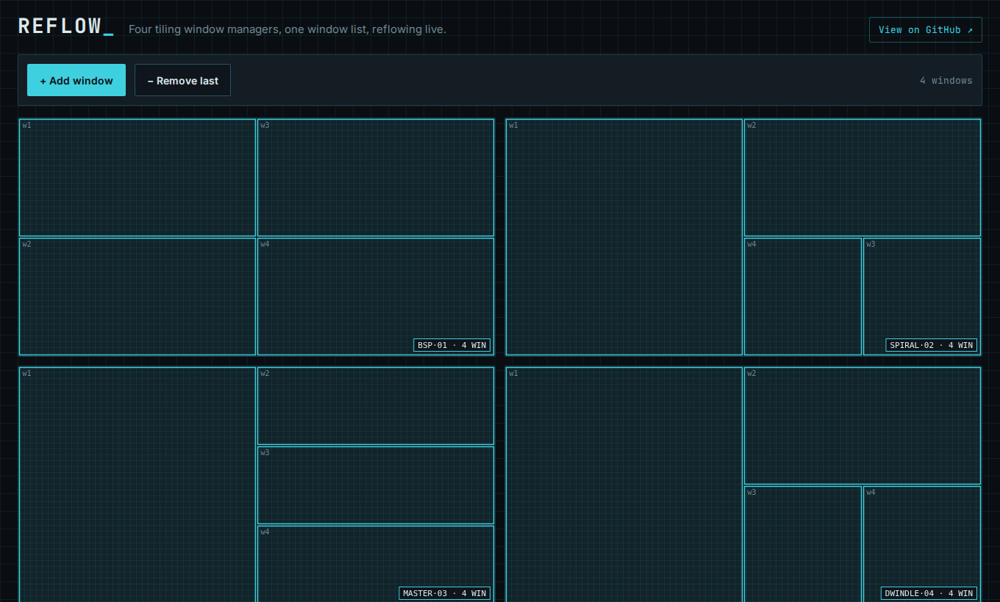

# Reflow

**▶ Live demo — [apps.charliekrug.com/tiler](https://apps.charliekrug.com/tiler/)**

[](https://github.com/ctkrug/tiler/actions/workflows/ci.yml)
[](LICENSE)

Four tiling window managers, one window list, reflowing live. Add windows,
drag one, and watch **BSP**, **spiral**, **master-stack**, and **dwindle**
retile the same set side by side, so you can see how each algorithm arranges
your screen instead of reading a paragraph about it.



## Who it's for

People who use or tinker with tiling window managers (i3, bspwm, dwm, xmonad,
Hyprland) and want to compare layout algorithms without installing four window
managers, plus anyone learning layout/geometry algorithms who wants to _watch_
them behave rather than read pseudocode.

## Why

Every tiling window manager ships a different layout algorithm, and the
differences change how your screen feels every day. But you can't compare them
without switching between window managers, or reading descriptions like "BSP
recursively splits the largest region" that never show you what that looks like
in motion. Reflow puts four implementations on one page, fed by the exact same
window list, so dragging a single window reveals all four behaviors in the same
instant.

## The four layouts

- **BSP** recursively halves the largest region, alternating vertical and
  horizontal cuts. The i3 and bspwm feel.
- **Spiral (Fibonacci)** carves a shrinking slice off the remaining space for
  each window, winding around the screen. Common in Hyprland and dwm patches.
- **Master-stack** keeps the first window in a large master area and shares the
  rest in a vertical stack. The classic dwm and xmonad default.
- **Dwindle** halves the leftover region toward one corner on every insertion,
  so later windows get progressively smaller.

## Features

- Four independent tiling engines, each a pure `(windows) => rects` function
  fed by one shared window list, so no pane can drift out of sync.
- Add or remove a window and all four panes re-tile from the same state within
  one animation frame.
- Drag a window onto another in any pane to reorder it; every pane reflows at
  once, with a tweened ~130ms ease-out transition (skipped when
  `prefers-reduced-motion` is set).
- Keyboard-accessible reordering: Tab into a pane, arrow keys select, Enter or
  Space picks a window up, arrow keys move it, Enter or Escape drops it, all
  announced through a live region for screen readers.
- Cross-pane highlight: hovering, dragging, or selecting a window in one pane
  highlights the same window in the other three.
- A blueprint visual language (cyan linework on grid paper, drafted title-block
  stamps per pane) with a responsive 2×2 desktop grid that stacks on phone.

## How to use it

Open the [live demo](https://apps.charliekrug.com/tiler/) (it starts seeded
with four windows) and:

- **Add / remove** windows with the toolbar buttons.
- **Drag** any window onto another to reorder the shared list; watch all four
  panes retile together.
- **Keyboard**: focus a pane, use arrow keys to select a window, Enter to pick
  it up, arrows to move it, Enter or Escape to drop.

Nothing is installed and nothing is saved; refresh to start over.

## Development

```bash
npm install
npm run dev      # Vite dev server, opens straight into the live grid
npm test         # vitest: all four algorithms + store + animation
npm run build    # tsc --noEmit && vite build -> dist/
npm run lint     # eslint
```

The four tiling algorithms and the interaction/animation math are pure
functions with no DOM dependency, unit-tested with 103 cases including
`fast-check` property tests that fuzz each algorithm across 0-40 windows and
assert every layout tiles the unit square with no overlaps. See
[`docs/ARCHITECTURE.md`](docs/ARCHITECTURE.md) for the module map,
[`docs/DESIGN.md`](docs/DESIGN.md) for the visual system, and
[`docs/VISION.md`](docs/VISION.md) for the rationale.

## Stack

TypeScript, HTML5 Canvas 2D, and Vite. No UI framework: the canvas rendering
and interaction loop don't need one.

## License

MIT, see [LICENSE](LICENSE).

---

More of Charlie's projects → [apps.charliekrug.com](https://apps.charliekrug.com)
</content>
</invoke>
